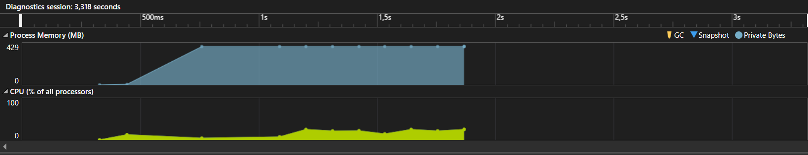

# Тестовые задания

## В этом файле я дам несколько пояснений к заданиям, которые помогут понять ход моих мыслей.

### 1.  Ломай меня полностью.  

   Реализуйте метод FailProcess так, чтобы процесс завершался. Предложите побольше различных решений.

```csharp
public class Program
{
    private static void Main(string[] args)
    {
        try
        {
            FailProcess();
        }
        catch { }

        Console.WriteLine("Failed to fail the process!");
        Console.ReadKey();
    }

    static void FailProcess()
    {
        // Этот метод используется для завершения текущего процесса и выхода из программы с указанным кодом завершения.
        // Environment.Exit(1);

        // Этот метод также используется для завершения текущего процесса, но он предназначен для обработки критических ошибок.
        // Environment.FailFast("Fail");

        // Сначала получаем информацию о текущем процессе и затем принудительно его останавливаем.
        Process.GetCurrentProcess().Kill();
    }
}
```

Выше приведены 3 способа для завершения процесса и их краткое описание.

### 2.  Операция «Ы».

Что выводится на экран? Измените класс Number так, чтобы на экран выводился результат сложения для любых значений someValue1 и someValue2.

До изменения класса, на экран выводилась конкатенация двух строк: 1+2=12.

```csharp
public class Program
{
    static readonly IFormatProvider _ifp = CultureInfo.InvariantCulture;
    class Number
    {
        readonly int _number;
        public Number(int number)
        {
            _number = number;
        }
        public override string ToString()
        {
            return _number.ToString(_ifp);
        }

        //Здесь просто переопределяем оператор
        public static string operator +(Number first, string second)
        {
            return (first._number + Convert.ToInt32(second)).ToString();
        }
    }
    static void Main(string[] args)
    {
        int someValue1 = 1000000;
        int someValue2 = -500;
        string result = new Number(someValue1) + someValue2.ToString(_ifp);
        Console.WriteLine(result);
        Console.ReadKey();
    }
}
```

Как видно, из кода выше, для решения задачи достаточно было переопределить оператор +. При переопределении мы конвертировали string к int и далее суммировали два целых числа. Результат приводился к строке.

### 3.  Мне только спросить!

Реализуйте метод по следующей сигнатуре:

```csharp
/// <summary>
/// <para> Отсчитать несколько элементов с конца </para>
/// <example> new[] {1,2,3,4}.EnumerateFromTail(2) = (1, ), (2, ), (3, 1), (4, 0)</example>
/// </summary> 
/// <typeparam name="T"></typeparam>
/// <param name="enumerable"></param>
/// <param name="tailLength">Сколько элеметнов отсчитать с конца  (у последнего элемента tail = 0)</param>
/// <returns></returns>
public static IEnumerable<(T item, int? tail)> EnumerateFromTail<T>(this IEnumerable<T> enumerable, int? tailLength)
```

Возможно ли реализовать такой метод выполняя перебор значений перечисления только 1 раз?

Да, возможно и я хочу предложить два решения:

Первое решение будет не самым оптимальным по скорости, потому что в нем мы переворачиваем исходный массив. Зато оно интуитивно понятное: 

```csharp
 public static IEnumerable<(T item, int? tail)> EnumerateFromTail<T>(this IEnumerable<T> enumerable, int? tailLength)
 {
    if (tailLength < 0)
    {
        throw new ArgumentException("Wrong tailLength.");
    }

     //Создаем переменную для результата
     List<(T item, int? tail)> result = new List<(T item, int? tail)>(capacity: enumerable.Count());

     //Переменная для присваивания значений хвосту
     int i = 0;

     //Создаем временную переменную для того, чтобы не дублировать вызов result.Add()
     int? temp;

     //Переворачиваем иcходнный массив
     foreach (T item in enumerable.Reverse())
     {
         if (i >= tailLength) { temp = null; }
         else { temp = i; }

         result.Add((item, temp));

         i++;
     }

     result.Reverse();
     return result;
 }
```

И второй вариант:

```csharp
public static IEnumerable<(T item, int? tail)> EnumerateFromTail<T>(this IEnumerable<T> enumerable, int? tailLength)
{
    if (tailLength < 0)
    {
        throw new ArgumentException("Wrong tailLength.");
    }

    //Приводим к массиву для перебора
    T[] items = enumerable.ToArray();

    int length = items.Length;

    //Массив для результата
    List<(T item, int? tail)> result = new List<(T item, int? tail)>(length);

    for (int i = 0; i < length; i++)
    {
        //По умолчанию tail=null пока не дойдем до хвоста
        int? tail = null;
        if (i >= length - tailLength)
        {
            //высчитываем хвост
            tail = length - i - 1;
        }
        result.Add((items[i], tail));
    }

    return result;
}
```

Во втором варианте производится только один перебор и он работает быстрее. Ниже представлены затраты по памяти и времени выполнения для двух алгоритмов, первого и второго соответсвенно(на 100 000 000 элементах):


Как можно заметить, выигрыш по времени почти в 2 раза(25 и 13 секунд).

После этого, я решил оптимизировать первое решение с помощью Linq:

```csharp
 public static IEnumerable<(T item, int? tail)> EnumerateFromTail<T>(this IEnumerable<T> enumerable, int? tailLength)
 {
     //Решение с Linq намного эффективнее, чем решение выше как по памяти, так и по времени выполнения, проверенно на 100 000 000 элементов в массиве
     return enumerable
     .Reverse()
     .Select((item, i) => (item, tail: (i >= tailLength) ? (int?)null : i))
     .Reverse();
 }
```

и результаты меня впечатлили:



Использование памяти было сокращено с 2.5 Гб до 429 Мб и время работы было сокращено до 3 секунд.

Подводя итог, могу заметить, что Linq оказался намного эффективнее в решении этой задачи.

### 4. Высший сорт.

Реализуйте метод Sort. Известно, что потребители метода зачастую не будут вычитывать данные до конца. Оптимально ли Ваше решение с точки зрения скорости выполнения? С точки зрения потребляемой памяти?

```csharp
/// <summary>
/// Возвращает отсортированный по возрастанию поток чисел
/// </summary>
/// <param name="inputStream">Поток чисел от 0 до maxValue. Длина потока не превышает миллиарда чисел.</param>
/// <param name="sortFactor">Фактор упорядоченности потока. Неотрицательное число. Если в потоке встретилось число x, то в нём больше не встретятся числа меньше, чем (x - sortFactor).</param>
/// <param name="maxValue">Максимально возможное значение чисел в потоке. Неотрицательное число, не превышающее 2000.</param>
/// <returns>Отсортированный по возрастанию поток чисел.</returns>
IEnumerable<int> Sort(IEnumerable<int> inputStream, int sortFactor, int maxValue)
```

Итак, теперь самая интересная задача на мой взгляд. Начнем с выбора алгоритма сортировки. Учитывая, что у нас есть диапазон заданных чисел, то логичнее всего использовать сортировку счетчиком(Counting Sort). 

Суть заключается в том, что нужно посчитать количество вхождений каждого числа в массиве и потом добавить эти элементы один за другим в новый, отсортированный массив по возрастанию:

```csharp
public static IEnumerable<int> Sort(IEnumerable<int> inputStream, int sortFactor, int maxValue)
{
    //Создаем массив для результата
    List<int> result = new List<int>(capacity: inputStream.Count());

    //Создаем временный массив для хранения количества повторений элементов в массиве. Это возможно благодаря тому, что есть диапазон значений, которые встречаются в массиве.
    int[] temp = new int[maxValue + 1];

    //Заполнене массива: как только встречается элемент в массиве, счетчит увеличивает значение на 1.
    foreach (int i in inputStream)
    {
        temp[i]++;
    }
    
    //Далее идем по временному массиву и собираем отсортированный массив.
    for (int i = 0; i < maxValue + 1; i++)
    {
        for (int j = 0; j < temp[i]; j++)
        {
            result.Add(i);
        }
    }

    Console.WriteLine($"Size of temp array: {sizeof(int)*temp.Length}");
    return result;
}
```

Сложность такого алгоритма будет линейной(n+k) и по скорости это решение будет оптимальным. Однако есть проблема в используемой памяти. Нужно создавать дополнительный массив result, чтобы хранить результат, что увеличивает количество используемой памяти вдвое.

Ниже представлены графики сравнения скорости и использования памяти между моим решением(n+k) и алгоритмом быстрой сортировки(nlog(n)) на 1 000 000 000 значений, не превышающих 2000:


Как видно из графика, мой алгоритм работает на 17 секунд быстрее, однако использует больше памяти. Эту проблему можно решить, если передавать в метод не IEnumerable<int>, а List<int>, однако по условию задания, нельзя было менять сигнатуру метода.

Кроме того, в сигнатуре метода есть переменная sortFactor, которая должна уменьшить количество элементов в temp массиве(массиве, в котором мы храним количество вхождений чисел), однако я не смог найти ей достойное применение. В свою защиту скажу, что массив temp не может занимать много памяти, так как значения по условию задачи ограничены 0 < x < 2000. Таким Образом массив temp не может занимать более 8 Кбайт, при условии, что значения в массиве будут Int32.

Была еще идея использовать не временный массив, а например SortDictionary, чтобы уменьшить количество используемой памяти. Однако такое решение занимает слишком много времени и не может быть использовано.

### 5. Слон из мухи.

Программа выводит на экран строку «Муха», а затем продолжает выполнять остальной код. Реализуйте метод TransformToElephant так, чтобы программа выводила на экран строку «Слон», а затем продолжала выполнять остальной код, не выводя перед этим на экран строку «Муха».

В этом задании я нашел единственное решение, которое выглядит примерно так: 

```csharp
static void Main(string[] args)
{
    TransformToElephant();

    Console.WriteLine("Муха");

    //... ваш пользовательский код

    for (int i = 0; i < 5; i++)
    {
        Console.WriteLine(i);
    }
}

static void TransformToElephant()
{
    //Создаем unsafe блок для работы с указателем.
    unsafe
    {
        //Создаем строку "Слон" и сохраняем ее в переменную elephant.
        ReadOnlySpan<char> elephant = "Слон";
        //Создаем указатель, который указывает на строку "Муха" с помощью конструктии fixed.
        fixed (char* ptr = "Муха")
            //Копируем содержимое строки "Слон" в строку "Муха".
            elephant.CopyTo(new Span<char>(ptr, 4));
    }
}
```

Большое спасибо, что сбросили мне это техническое задание. Было достаточно интересно его делать и могу сказать, что я кое чему научился. Будет здорово, если вы предоставите какой либо фидбек по нему для того, чтобы я мог совершенствовать свои знания. 

Кроме того, можете посмотреть веб приложение, котороя я реализовал в рамках пет-проекта.

Сервер: https://github.com/Sir-Alexio/InnoGotchiGame.Api

Клиент: https://github.com/Sir-Alexio/InnoGotchiGame.WebApp